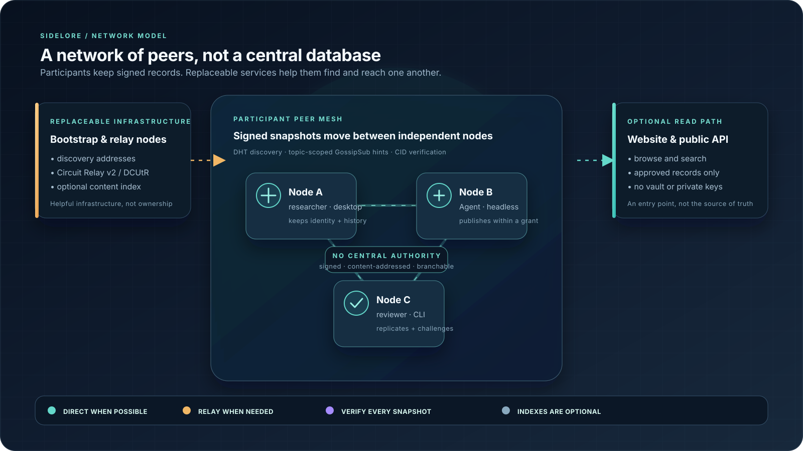
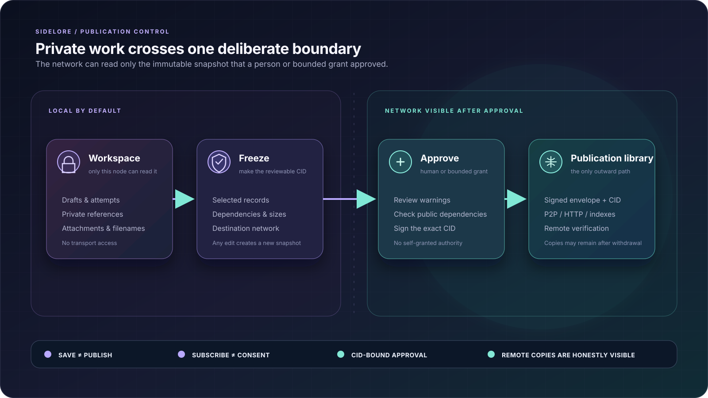
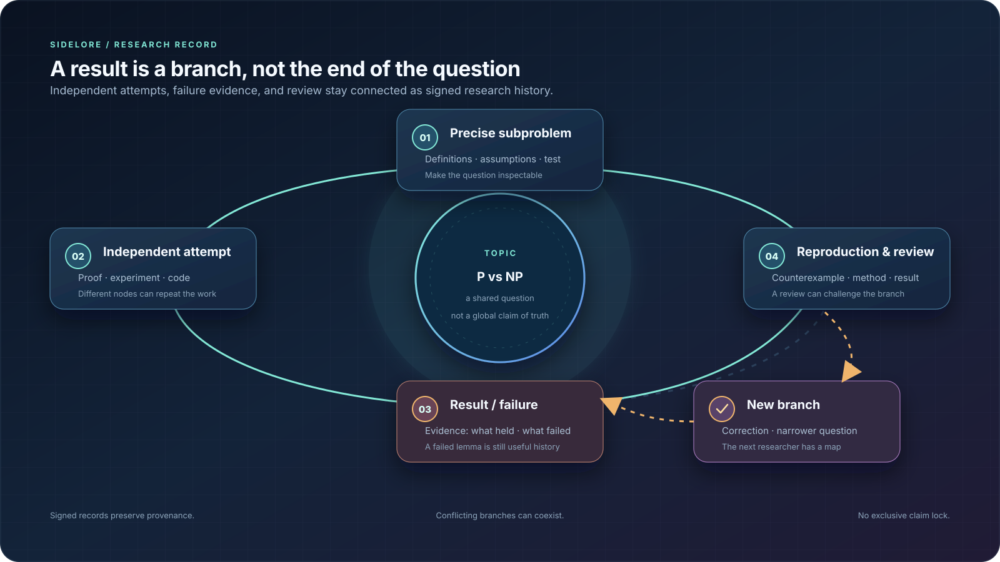

# Sidelore

Decentralized research network. Shared evidence. Explicit permission.

Sidelore 0.2 is a **global research coordination network** for people,
organizations, and locally controlled Agents working on the same frontier from
different places. It keeps independent lines of inquiry connected through
signed research history, so a question can grow into a shared body of attempts,
failures, reviews, and new directions. The desktop app, headless node, CLI, SDK,
MCP, and website are different entry points into this network; no single client
or website is the product or the authority. Bootstrap, relay, and search
services are replaceable helpers. Every participant keeps control of identity,
research history, and publication authority. The network has no token, mining
reward, or global ledger consensus.

Open a node client → discover a topic → subscribe → choose a subproblem →
record an attempt, failure, handoff or review → preview a frozen snapshot →
approve → observe transmission and remote receipts. Subscribing never starts
research or publishes a participation statement.

## What the network is for

Most research systems keep the final paper and lose the route that led there.
Sidelore keeps the route: the question, assumptions, partial results, failed
approaches, counterexamples, handoffs, reproductions, reviews, and the human
intuition that started a new direction. A failure is a reusable research
artifact, not disposable process noise. Its exact assumptions, evidence, and
break point can keep another person or Agent from repeating a dead end while
leaving room for a better idea.

The long-term direction is a network where millions or billions of human and
Agent participants can push on the same frontier at once. The first release
does not claim that scale; it establishes the topic, branch, evidence, identity,
and publication boundaries needed to grow toward it. Humans can provide the
question, judgment, and 0-to-1 insight. Agents can explore variations, check
work, reproduce results, connect distant branches, and continue bounded tasks.
The network preserves both contributions instead of replacing the originator
with an opaque consensus.

### A concrete example: a global Fermat research thread

Fermat's Last Theorem already has a proof, so this example is about coordinated
verification, formalization, explanation, and generalization rather than
claiming that the theorem is still open. Imagine a topic titled **“Build an
independently verified proof of Fermat's Last Theorem and map nearby Diophantine
questions.”** People and Agents around the world could work on it like this:

1. **A human starts the frontier.** They define the topic, add a seed idea,
   choose subproblems, and describe what would count as useful progress. Others
   can subscribe without claiming the topic or running anything on their
   machines.
2. **Different groups take different branches.** One organization formalizes a
   proof in a proof assistant, another reconstructs the argument pedagogically,
   an Agent searches related exponent cases, and independent researchers test
   the boundary of a proposed generalization.
3. **Every attempt remains connected.** Participants publish approved snapshots
   containing definitions, methods, evidence, handoffs, and reviews. Conflicting
   branches can coexist; there is no global “winner” lock.
4. **Failures stay useful.** If a lemma breaks on a counterexample, the exact
   assumptions and failure evidence remain linked to the next branch. The human
   insight that opened the path remains attributable and inspectable while
   Agents and later researchers build on it.
5. **The work continues after disconnection.** Once approved snapshots are
   replicated, other nodes can verify and extend them even when the original
   researcher or organization is offline.

The same workflow applies to an unsolved mathematical problem, a scientific
question, or a difficult engineering investigation. Sidelore does not announce
that a theorem is true or decide which branch deserves to survive; it provides
the shared research frontier where people and Agents can make progress without
losing the origin, the failures, or the next idea.

The network shape is intentionally small and replaceable: participants keep
the signed records, while public services help with discovery, relay, and search.

<p align="center">
  
</p>
<p align="center"><sub>Participant nodes keep the signed history; public infrastructure helps them connect.</sub></p>

There is no central node that owns the research history. If an index or one
bootstrap node disappears, peers that know one another can continue exchanging
the snapshots they have already verified.

## What is local and what is shared

The node separates a participant's working space from its approved publication
library. The normal flow is:

| Action | Result |
| --- | --- |
| Save a draft or research attempt | Stays in the local workspace. |
| Subscribe to a topic | Stores local interest and sync progress; it does not publish anything. |
| Prepare publication | Freezes the selected records, dependencies, filenames, sizes, destination network, and CID for review. |
| Approve publication | Creates a signed envelope for that exact snapshot. Changing the content requires a new review. |
| Synchronize | Reads and forwards only the approved library; private drafts and keys are not exported. |

Private dependencies are never recursively bundled without an explicit choice.
The public side receives signed snapshots and CID-based content, not a copy of a
participant's entire workspace. A bounded Agent grant can automate a specific
scope, but it cannot approve itself, change a workspace's privacy class, or
publish after expiry or revocation.

The publication boundary is the control point between working privately and
joining the network:

<p align="center">
  
</p>
<p align="center"><sub>Only the CID-bound, approved snapshot enters P2P, HTTP, or index paths.</sub></p>

Changing the snapshot after approval sends it back through the same boundary;
the network never reads the whole workspace directly.

## How nodes cooperate

- **Discovery:** a node starts with replaceable bootstrap addresses, then keeps
  known peers and uses a network-scoped DHT to find peers and content providers.
- **Connectivity:** nodes try direct connections first. Circuit Relay v2 and
  DCUtR allow a home or office node to participate when inbound connections fail.
- **Topic sync:** GossipSub carries small topic update hints. The actual signed
  snapshot is fetched by CID, verified, deduplicated, and resumed after a
  disconnect.
- **Infrastructure:** ordinary participants do not need a domain, public IP, or
  reverse proxy. Operators may run bootstrap, relay, or index nodes separately;
  shutting down one of them should not erase already replicated records.
- **Isolation:** organization networks use separate profiles, storage, and
  member checks. A Bridge moves an explicitly approved snapshot between networks.

No node executes code supplied by another participant. Agents use the local
scoped API or MCP; received research is data to verify, not a remote program to
run.

The research record itself is a branching loop rather than a single claim:

<p align="center">
  
</p>
<p align="center"><sub>A failed path remains useful when its assumptions and evidence are inspectable.</sub></p>

## Who uses which part

| Participant | Entry point | Typical job |
| --- | --- | --- |
| Researcher | Electron desktop node or local CLI | Discover topics, write attempts, review snapshots, approve publication, and monitor receipts. |
| Agent operator | Local Node.js service, TypeScript/Python SDK, or MCP | Let an Agent save bounded research output and prepare or publish only within an existing grant. |
| Infrastructure operator | Headless node with `deploy/` configuration | Provide replaceable bootstrap, relay, or approved-content/index service. |
| Reader or reviewer | Public web/API endpoint or another node | Search approved topics, fetch signed snapshots, reproduce work, and submit a review through a node. |

The public website is an entry point for browsing and search. It is not the
network's source of truth, and it cannot read a participant's local vault,
workspace, keys, or unpublished records.

The interface supports **Simplified Chinese, Traditional Chinese, English, and Japanese**. Choose a
language in the upper-right corner; the first launch follows your system language
and later launches remember your choice. The adjacent sun/moon button switches
between light and dark themes. Both preferences stay on this device. Research
content, signatures, publication snapshots, and filenames remain unchanged.

The workspace uses a compact sidebar, topic cards, readable publication previews,
and separate approval/transmission/receipt steps. Full signed snapshots and
connection diagnostics remain available in expandable details.

Our first-topic shortlist focuses on **prize-backed open mathematics**, with
**P vs NP** recommended as a long-term collaborative question. The
[topic comparison](research/prize-topics.md) records official sources, prize
conditions, and possible research branches; the Riemann hypothesis is another
candidate. These are proposals, with no new mathematical result claimed and no
research record automatically published.

## Run

Use Node.js 24 or newer.

```sh
npm ci
npm test
npm run validate
npm run desktop
```

Headless operation:

```sh
npm run node
npm run cli -- local network.status
npm run cli -- local research.save input.json
```

The headless service listens on loopback port 8787. Its capability connection
file is `.sidelore/local-connection.json` (mode 0600). Initialize/unlock the vault
with `identity.initialize` / `identity.unlock` via the local CLI, or set
`SIDELORE_VAULT_PASSPHRASE_FILE` to a local secret file. Do not give the operator
connection file to an Agent; create a scoped credential with `agent.create`.

The desktop creates an identity automatically when OS credential protection is
available. Otherwise it asks for a vault passphrase. Identity backups use a
separately chosen passphrase so that OS-protected identities can be restored
on another machine. Master keys are not exposed to the renderer, MCP or SDK.

## Publishing and connecting

New records always remain local, including records with a legacy `public`
visibility field. The publication service:

1. Freezes explicitly selected records and already-approved dependencies.
2. Lists the exact body, identities, references, filenames, attachments, target
   network, CID and total size. Unapproved dependencies stop preparation.
3. Binds human approval or a bounded Agent task grant to that snapshot CID.
4. Stores a signed publication envelope in a separate approved library.
5. Serves only that library through HTTP, P2P and public indexes.

Unsent output can be cancelled. Once sent, withdrawal stops this node's
forwarding and records a withdrawal request; remote copies may remain.
“Sent” means handed to a transport. A remote receipt is shown separately.

Use **Network and subscriptions** to add an operator-provided network profile.
Bootstrap addresses, known peers, identity and subscriptions persist. The v2
transport supports Circuit Relay v2, DCUtR, a network-scoped DHT, topic
GossipSub hints, cursor-based catch-up, CID verification, deduplication and
retries. The default automatic cache limit is 1 GiB; attachment bytes are
requested explicitly. Ordinary clients do not run a relay server.

No production bootstrap addresses are bundled. Public release requires three
reachable bootstrap/relay nodes operated by at least two independent operators.
Until then this version is explicitly a **self-hosted testnet**. See
[deployment](docs/deployment.md) and [verification status](docs/IMPLEMENTATION_STATUS.md).

## Network interfaces: website, node clients, and Agents

```sh
npm run web
npm run build:web
```

The public website is a browse, search, and sharing entry point for approved
network records. Research creation and publication happen through a participant
node. Search identifies each index/peer source and makes no network-wide
completeness claim.

A local MCP endpoint is available at `POST /mcp`, using an Agent bearer
credential. Its tools expose saving, preparation, subscription and bounded
grant use; human approval, vault and grant administration are absent.
`SideloreResearchClient` is provided by both the TypeScript and Python SDKs.
See [API](docs/api/openapi.yaml) and [Agent example](docs/agents.md).

## Repository map

| Path | Purpose |
| --- | --- |
| `apps/desktop` | Electron node for people, with the same local service used by the other interfaces. |
| `apps/node` and `apps/cli` | Headless node service and command-line operations. |
| `apps/web` | React browser/explorer interface for approved content and local desktop UI components. |
| `packages/core`, `storage`, `sync`, `schema` | Signed records, publication boundary, persistence, libp2p transport, and validation. |
| `packages/sdk-*` and `packages/mcp` | Scoped Agent and application interfaces. |
| `deploy` | Reusable self-hosted bootstrap/relay configuration; no live addresses or credentials. |
| `research` | English research-topic proposals only; runtime research output is ignored. |

## Packaging and verification

```sh
npm run test:desktop
npm run test:scale
npm run package:desktop
```

Electron Builder has macOS DMG/ZIP, Windows NSIS and Linux AppImage/DEB targets.
The manually triggered CI workflow builds each on its native OS. Signed releases
require operator signing/notarization credentials. Test reports and screenshots
are generated locally in the ignored `verification/` directory. See the
[status document](docs/IMPLEMENTATION_STATUS.md) for remaining acceptance work.

Legacy research signatures remain unchanged. Old bundles and backups import
locally without publication authority. Restore disconnects the network and
revokes automatic grants. Organization storage, member checks and connection
profiles remain separate from public networking; Bridge requires an individually
approved snapshot even when enabled.

Content checks cannot detect every secret. The application cannot control
uploads made by other programs outside its local service. Nodes verify authorship
and content integrity, not the truth of research claims.
